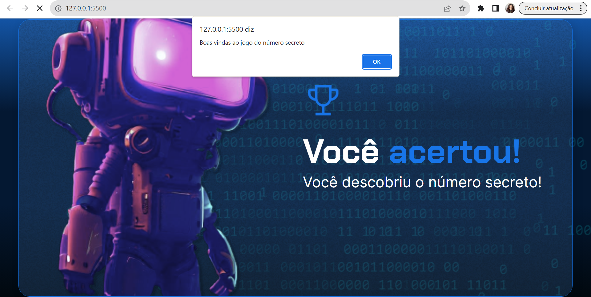

# Projeto Inicial

Desafio proposto pela Alura para testar lógica de programação com JavaScript. O projeto se baseia em criar um jogo com tentativas para acertar um número secreto, com condições, acertos e erros.

## Índice
- <a href= "#funcionalidades">Funcionalidades do Projeto</a>
- <a href= "#tecnologias utilizadas">Tecnologias utilizadas</a>
- <a href= "#rodar">Como rodar este projeto?</a>
- <a href= "#pessoa">Pessoa autora</a>

## 📱Funcionalidades do projeto

- Oferecer um alert para que o usuário adivinhe o número secreto;
- Validar a depender do valor digitado se o usuário acertou ou errou;
- Tela de acerto para o cenário de sucesso;
- Possibilidade de nova tentativa em cenário de erro.

## Tecnologias utilizadas

1. [HTML](https://developer.mozilla.org/en-US/docs/Web/HTML)
2. [CSS](https://developer.mozilla.org/en-US/docs/Web/CSS)
3. [JavaScript](https://developer.mozilla.org/en-US/docs/Web/JavaScript)

## 💻Como rodar este projeto?
```bash
# Clone este repositório
$ git clone linkrepo

# Acesse a pasta do projeto no seu terminal
$ logica-js-projeto_inicial

# Instale as dependências
$ npm install

# Execute a aplicação
$ npm run start

# A aplicação será iniciada na porta 3000, acesse pelo navegador: http://localhost:3000
```

## Pessoa autora

[Julia Goulart - Linkedin](https://www.linkedin.com/in/juliagoulartux/)